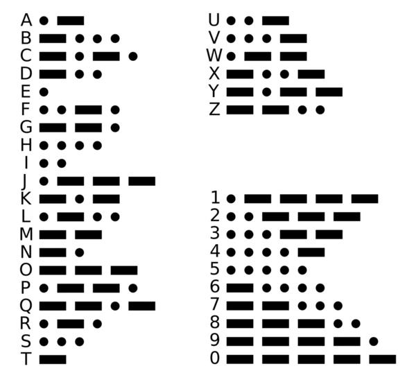

## Morse code translator

Morse code uses dots and dashes to communicate different letters and characters. Morse code was critical for communication during World War II. It was also used as an international standard for communication at sea until 1999, when it was replaced by the Global Maritime Distress Safety System. Given a word or phrase return a string composed of dots and dashes to represent the message. 

Here is an image showing the morse code values of all 26 letters of the alphabet plus numbers 0 - 9.


In morse code pauses denote the breaks between dots and dashes, between characters, and between words. Each dot or dash within a character is followed by period of signal absence equal to the dot duration. The letters of a word are separated by a space of duration equal to three dots, and the words are separated by a space equal to seven dots. For our purposes we can represent words as strings of dots (`'*'`) and dashes (`'-'`) separated by a space. Phrases can be represented by arrays of word strings.

For example the phrase `'HELLO WORLD'` would be represented like this:
```
['**** * *-** *-** ---', '*-- --- *-* *-** -**']
```

Goot Luck!